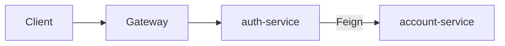
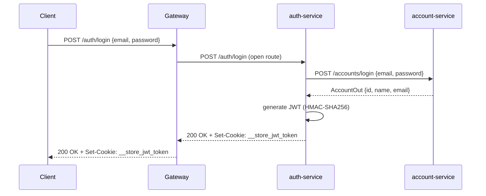

# pma.261.auth-service

Runnable Spring Boot microservice that handles authentication and JWT lifecycle. It implements the `AuthController` interface from the `auth` library and delegates account lookups to the `account-service` via Feign.

## Overview

`auth-service` is the only service that issues and validates JWTs. It sits behind the gateway and is also called directly by the gateway filter to resolve tokens before forwarding protected requests.



### Login flow



## Stack

| Layer | Technology |
|---|---|
| Language | Java 25 |
| Framework | Spring Boot 4.x + Spring Cloud OpenFeign |
| Security | JJWT (HS256 / HMAC-SHA) |
| Utilities | Lombok |

## Endpoints

All routes are prefixed with `/auth`. The service listens on port `8080`.

| Method | Path | Auth required | Description |
|---|---|---|---|
| `POST` | `/auth/login` | No | Validate credentials, issue JWT cookie |
| `POST` | `/auth/register` | No | Create a new account via account-service |
| `GET` | `/auth/logout` | No | Clear the JWT cookie (sets `maxAge=0`) |
| `POST` | `/auth/solve` | No | Validate a JWT and return the `idAccount` |
| `GET` | `/auth/whoiam` | Yes (`id-account` header) | Return account details for the given ID |
| `GET` | `/auth/health-check` | No | Liveness probe, returns `200 OK` |

## JWT Cookie

On successful login a `Set-Cookie` response header is sent:

| Attribute | Value |
|---|---|
| Name | `__store_jwt_token` |
| `HttpOnly` | configurable (`JWT_HTTP_ONLY`) |
| `Secure` | `true` |
| `SameSite` | `None` |
| `Path` | `/` |
| `MaxAge` | 24 hours (86 400 000 ms) |

The JWT payload contains: `id` (account UUID), `sub` (name), `email` claim, `iss` (`Insper::PMA`), `nbf`, and `exp`.

## Environment Variables

| Variable | Description |
|---|---|
| `JWT_SECRET_KEY` | Base64-encoded HMAC secret key used to sign and verify tokens |
| `JWT_HTTP_ONLY` | Boolean — whether the cookie is `HttpOnly` |

## Configuration (`application.yaml`)

```yaml
server:
  port: 8080

store:
  jwt:
    secretKey: ${JWT_SECRET_KEY}
    duration: 86400000   # 24 hours in milliseconds
    httpOnly: ${JWT_HTTP_ONLY}
```

## Internal Dependencies

| Service | How | Purpose |
|---|---|---|
| `account-service` | Feign (`http://account:8080`) | Look up accounts by credentials or ID, create accounts on register |

## Build & Run

```bash
mvn clean package
java -jar target/auth-1.0.0.jar
```

Or via Docker Compose (service name: `auth`).
